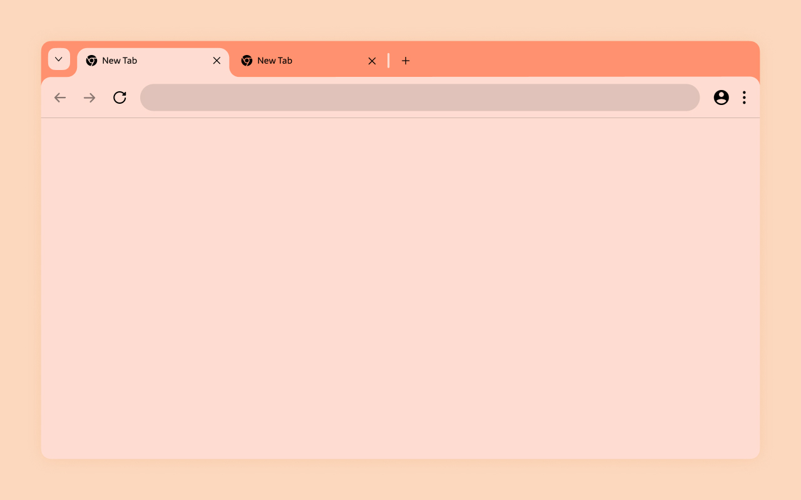
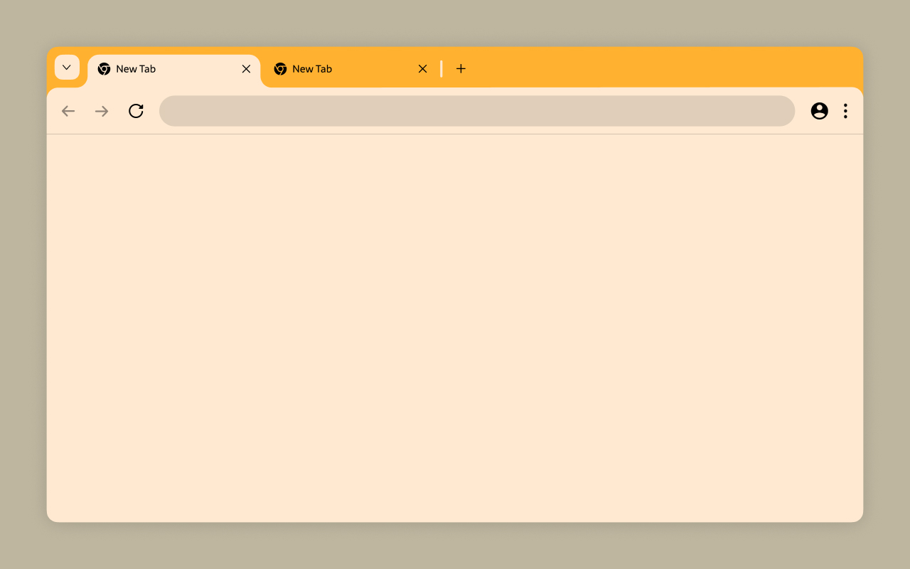
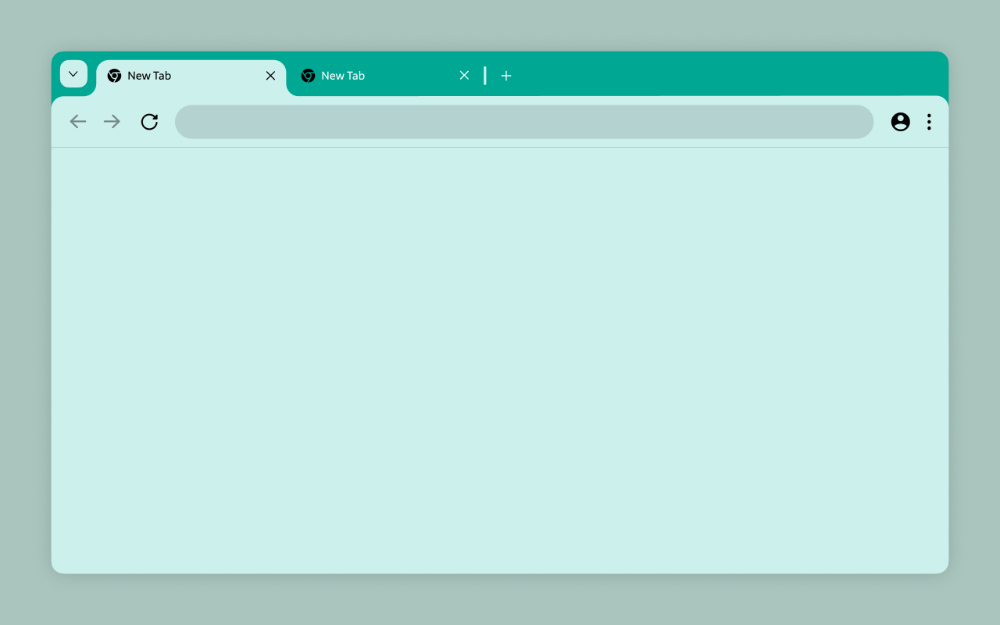

# Chrome Color Themes

Welcome! Here you will find a collection of custom themes for Chromium browsers, designed to enhance your browsing experience with unique and vibrant visuals.

## Available Themes

### Sweet Muskmelon

### Pale Banana

### Wet Turquoise

## How to Install

### From the Chrome Web Store

You can easily install any of the themes directly from the Chrome Web Store by clicking on the links below:

- [Sweet Muskmelon](https://chromewebstore.google.com/detail/sweet-muskmelon/jjcgelmhhaldmodmbgielcpieelodofh)
- [Pale Banana](https://chromewebstore.google.com/detail/pale-banana/behdbikklpdgcilgeaocajkjkopppjai)
- [Wet Turquoise](https://chromewebstore.google.com/detail/wet-turquoise/monldnmbjmekhjddmpegagaekcdgleek)

### From GitHub Releases

You can also download the `.crx` files from the [releases section](https://github.com/MajedAlghoul/Chrome-Themes/releases/tag/v1.0-Themes-Crx) of this repository and install them manually. Follow these steps:

1. Download the desired `.crx` file from the [Releases](https://github.com/MajedAlghoul/Chrome-Themes/releases/tag/v1.0-Themes-Crx) page.
2. Open Chrome and navigate to `chrome://extensions/`.
3. Enable "Developer mode" using the toggle switch in the top right corner.
4. Drag and drop the downloaded `.crx` file onto the Extensions page.
5. Confirm the installation.

---

Enjoy customizing your Chrome browsing experience with these unique themes! If you have any questions or suggestions, please open an issue or contact me directly.

Happy Theming!
